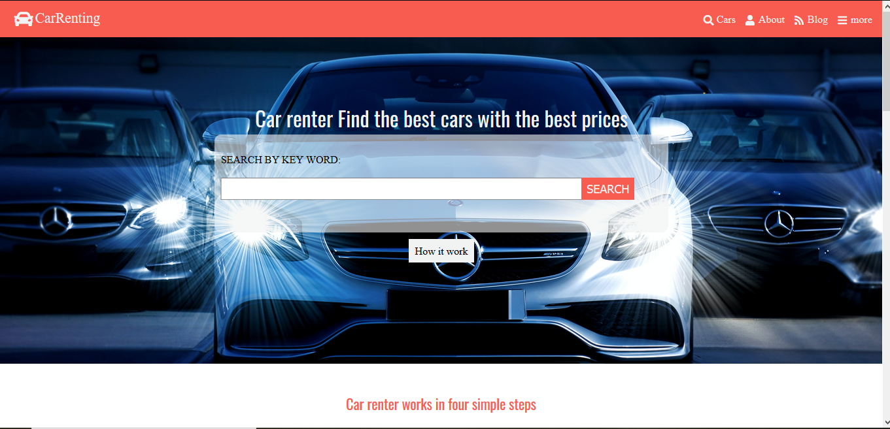

## HTML & CSS Capstone Project

Project: HTML & CSS Capstone Project

## Description

this is the HTML/CSS Capstone project, and it is a Car renting web site that later it will have a backend service that will make it possible to search for cars and find the closes cars to you.

##Screenshot of the website



## Built With

- HTML5
- CSS3
- Fontawesome
- Google Font

## Deploy Tool

- Netlify

## Live Demo

[Live Demo Link](https://laughing-kare-56027c.netlify.app/)

# Getting Started 🚀

These instructions will get you a copy of the project up and running on your local machine.

## How To Use 🔧

From your command line, first clone the project:

```bash
# Clone this repository
$ git clone https://github.com/rida-elbahtouri/HTML-CSS-capstone-project.git

# Go into the repository
$ cd HTML-CSS-capstone-project

```

## DEVELOPER

👤 **Rida Elbahtouri**

- [Github](https://github.com/rida-elbahtouri)
- [Twitter](https://twitter.com/RElbahtouri)
- [Linkedin](https://www.linkedin.com/in/rida-elbahtouri-36a8a7185/)

## Show your support

Give a ⭐️ if you like this project!
